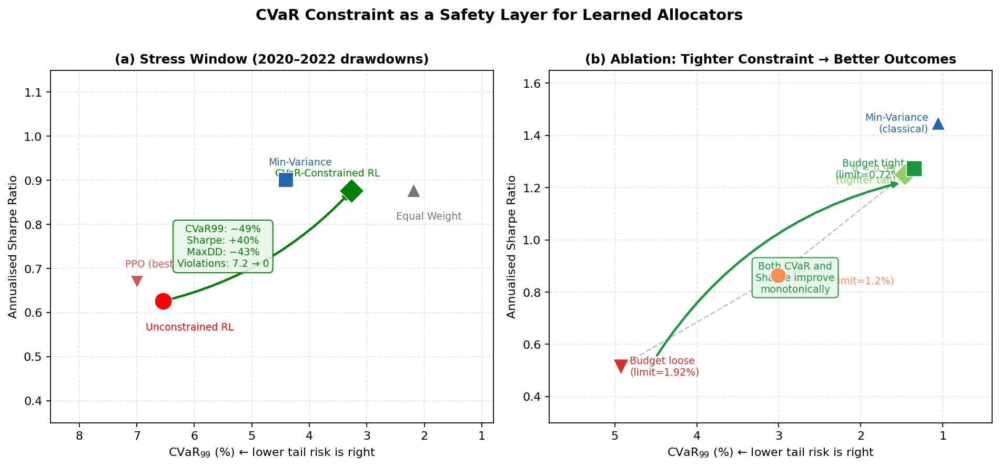
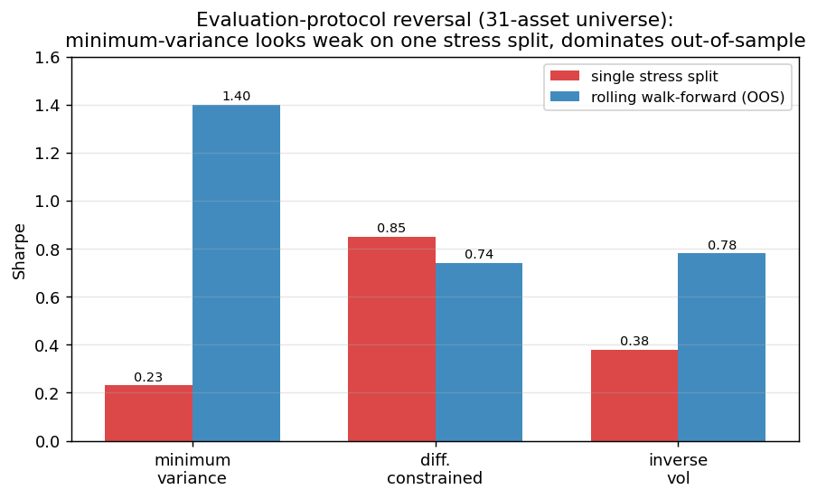
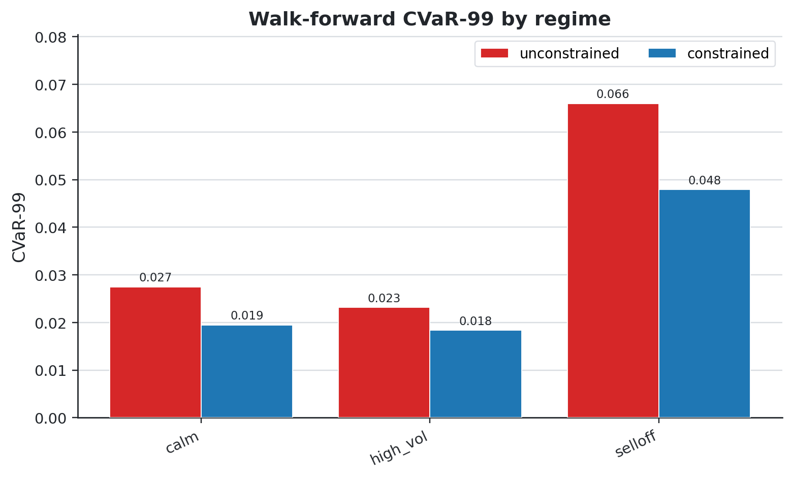

# CVaR-Constrained RL Portfolio Allocator

[](https://github.com/nl2992/ICAIF_cvar-rl-portfolio-allocator/actions/workflows/ci.yml) [](LICENSE) [](environment.yml)

<p align="center">
  
</p>

<p align="center"><em>An explicit CVaR constraint cuts the tail of a *learned* allocator (constrained vs unconstrained) without sacrificing risk-adjusted return.</em></p>

Research stack for dynamic multi-asset allocation that directly controls downside
tail risk through a **CVaR constraint**. A constrained actor-critic allocator is
compared against deterministic optimisers and an unconstrained RL baseline, after
transaction costs and under portfolio constraints.

## Research question

> Can a constrained actor-critic allocator reduce tail risk and constraint
> breaches versus unconstrained RL while remaining competitive with standard
> portfolio optimisers after costs?

**Headline result** (real 7-ETF universe, trained pre-2018, tested through the
2020 COVID crash + 2022 selloff, mean over 5 seeds): the CVaR constraint cuts
**CVaR-99 by ~49% and max drawdown by ~43%** versus unconstrained RL, while
*raising* Sharpe (0.63→0.88) — competitive with minimum-variance (0.90) at far
lower tail risk. See [`reports/etf_study.md`](reports/etf_study.md).

## What is implemented

| Component | Module |
| --- | --- |
| Regime-switching synthetic data (+ parquet dataset build) | `crlpa/data/synthetic.py`, `scripts/build_dataset.py` |
| **Real ETF data loaders** (Yahoo adjusted close → weekly returns) | `crlpa/data/load_prices.py`, `crlpa/data/build_dataset.py` |
| Allocation environment with no-look-ahead observations, costs, rolling CVaR, drawdown | `crlpa/envs/allocation.py` |
| Admissible-set projection: long-only, max weight, cash floor, turnover & gross caps | `crlpa/envs/constraints.py` |
| Deterministic baselines: equal weight, inverse vol, min-variance, mean-variance, risk parity, min-CVaR (Rockafellar–Uryasev LP) | `crlpa/policies/baselines.py` |
| Model-free CVaR-constrained actor-critic: actor, return critic, **safety critic**, Lagrange dual | `crlpa/models/`, `crlpa/training/lagrangian.py` |
| **Differentiable allocator** (residual policy over adaptive anchor; differentiable CVaR penalty) — the strong learner | `crlpa/training/differentiable.py` |
| Metrics, backtest harness, paired block-bootstrap significance tests | `crlpa/evaluation/` |

The **unconstrained RL baseline** is the same agent with `constrained=False`
(Lagrange multiplier frozen at zero).

| Component | Module |
| --- | --- |
| Regime-switching synthetic data (+ parquet dataset build) | `crlpa/data/synthetic.py`, `scripts/build_dataset.py` |
| Allocation environment with no-look-ahead observations, costs, rolling CVaR, drawdown | `crlpa/envs/allocation.py` |
| Admissible-set projection: long-only, max weight, cash floor, turnover & gross caps | `crlpa/envs/constraints.py` |
| Deterministic baselines: equal weight, inverse vol, min-variance, mean-variance, risk parity, min-CVaR (Rockafellar–Uryasev LP) | `crlpa/policies/baselines.py` |
| CVaR-constrained actor-critic: actor, return critic, **safety critic**, Lagrange dual | `crlpa/models/`, `crlpa/training/lagrangian.py` |
| Episodic training with Lagrangian CVaR control + validation-best checkpointing | `crlpa/training/train_allocator.py` |
| Metrics, backtest harness, paired block-bootstrap significance tests | `crlpa/evaluation/` |

The **unconstrained RL baseline** is the same actor-critic with
`constrained=False` (Lagrange multiplier frozen at zero, safety critic ignored).

## Method in brief

At each weekly decision step the actor maps the state to a Gaussian over
pre-softmax logits; a softmax yields long-only weights, which are projected onto
the admissible set. Transaction costs are charged on realised trades and
next-period returns are applied. A rolling historical CVaR of net returns drives
the per-step constraint cost `max(0, CVaR − limit)`. A safety critic estimates the
discounted cost-to-go, and a Lagrange multiplier (projected dual ascent) penalises
the policy objective when the CVaR budget is breached.

## Quickstart

```bash
python -m venv .venv
source .venv/bin/activate
pip install -e ".[dev,rl]"     # rl extra pulls in torch
pytest
```

## End-to-end pipeline

```bash
python scripts/build_dataset.py     --config configs/experiment.yaml
python scripts/run_baselines.py     --config configs/experiment.yaml
python scripts/train_allocator.py   --config configs/experiment.yaml      # or: --episodes 50 --seeds 7 13
python scripts/evaluate_allocator.py --config configs/experiment.yaml
python scripts/make_report.py       --experiment_id cvar_ac_v1
```

Outputs land in `results/tables/` (metrics, statistical tests),
`results/checkpoints/`, `results/training_curves/`, and `reports/final_report.md`.

For the real-ETF differentiable-allocator stress study (the headline result):

```bash
python scripts/build_dataset.py    --config configs/experiment_etf.yaml --out data/processed/aligned_portfolio_panel_etf.parquet
python scripts/run_diff_study.py   --config configs/experiment_etf.yaml   # headline stress study -> results/tables_diff/
python scripts/run_walk_forward.py --config configs/experiment_etf.yaml   # rolling OOS + regime slices + fold tests
python scripts/run_robustness.py   --config configs/experiment_etf.yaml   # costs / CVaR limit / universe perturbations
python scripts/run_ablations.py    --config configs/experiment_etf.yaml   # anchor / alpha / risk budget / objective
python scripts/run_macro_study.py  --config configs/experiment_etf.yaml   # market-only vs macro+factor state
```

Additional model-free baseline: `crlpa/training/ppo.py` (clipped PPO with GAE and
an optional CVaR Lagrangian). The strong learner is the differentiable allocator
(`crlpa/training/differentiable.py`).

## Configuration

`configs/experiment.yaml` is the master config the scripts read; the per-phase
files (`data`, `universe`, `env`, `model`, `training`, `backtest`.yaml) mirror its
sections for readability. Switch `data.source` from `synthetic` to `parquet` to run
off a frozen dataset built by `build_dataset.py`. Canonical seeds: `7, 13, 23, 42, 2025`.

## Repo layout

```text
src/crlpa/
  data/        synthetic regime data + real ETF/macro loaders
  features/    macro features, rolling factor betas, exog builder
  envs/        allocation environment (+ optional exog) + constraint projection
  models/      actor, critic, safety critic, CVaR actor-critic agent
  policies/    deterministic baselines
  training/    A2C + Lagrangian dual, PPO, differentiable allocator
  evaluation/  metrics, backtest, bootstrap, walk-forward, regimes, stress
  experiment.py  config -> data/env/agent builders shared by scripts
configs/       master + per-phase YAML configs (+ experiment_etf.yaml)
scripts/       build_dataset / run_baselines / train_allocator / evaluate_allocator /
               run_diff_study / run_walk_forward / run_robustness / run_ablations /
               run_macro_study / make_report
tests/         env, constraints, metrics, baselines, models, PPO, differentiable,
               features, walk-forward, stress, no-look-ahead
reports/       generated reports + project scope + ETF study
```

## Status and roadmap

Built on **synthetic regime-switching data** so the full pipeline runs offline and
end-to-end. Real-data loaders (`src/crlpa/data/load_*.py`), feature engineering,
walk-forward validation, and the robustness/ablation suites from `TODO.md` plug
into the same environment, baseline, and evaluation interfaces.


<!-- readme-enhanced -->
## Figures



*Evaluation-protocol reversal: a single stress window ranks the learner #1, while rolling walk-forward inverts the ranking — one of the two failure modes this paper isolates.*



*Regime-sliced CVaR-99: the constraint binds hardest in high-volatility weeks, the domain where the hybrid beats min-variance.*

## Reproduce (data → analysis → paper)

**Prerequisites.** Python 3.11. For the exact pinned environment use conda — `conda env create -f environment.yml && conda activate crlpa` — or with pip:
```bash
pip install -e .
```

**End-to-end pipeline.** Each step writes versioned artifacts consumed by the next:

```bash
# 1. Build the dataset (7-ETF weekly panel, leak-free)
python scripts/build_dataset.py --config configs/data.yaml

# 2. Deterministic baselines (equal-wt, inverse-vol, min-var, mean-var, risk-parity, min-CVaR)
python scripts/run_baselines.py --config configs/backtest.yaml

# 3. Train the CVaR-constrained allocator (+ unconstrained twin)
python scripts/train_allocator.py --config configs/training.yaml

# 4. 40-fold two-universe walk-forward + significance
python scripts/run_stats_study.py

# 5. Regime-switch hybrid threshold-sensitivity sweep
python scripts/run_hybrid_threshold_sweep.py

# 6. Regenerate all paper figures
python scripts/make_figures.py

```

The compiled paper is **`paper/main.tex → paper/main.pdf`**; every number and figure above is regenerated by the steps here.

**Exact reproduction.** Tested with Python 3.11. The committed `results/` tables are the exact published numbers; training and evaluation are deterministic under the fixed seeds in `configs/`. The processed price panels are committed under `data/processed/`, so the deterministic steps reproduce **offline** — verified: `python scripts/run_baselines.py --config configs/experiment.yaml` regenerates `results/tables/baseline_metrics.csv` byte-identically. Prices originate from Yahoo Finance adjusted close (`crlpa/data/load_prices.py`); vendor history can be revised, so the committed panel and results are canonical for the published figures.
