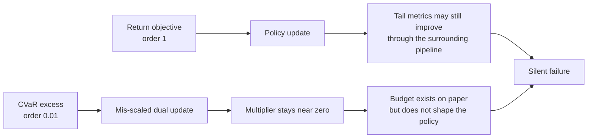
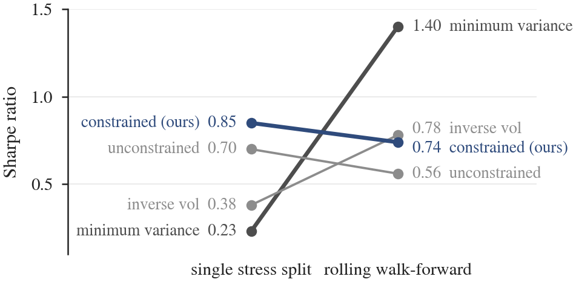
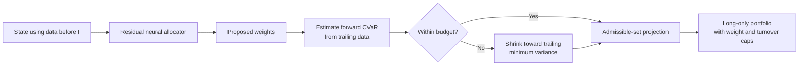
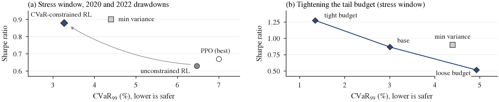
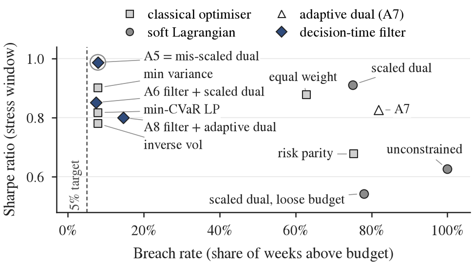

# Making Tail Constraints Bind: Two Silent Failure Modes in CVaR-Constrained Portfolio RL

[](https://github.com/nl2992/ICAIF_cvar-rl-portfolio-allocator/actions/workflows/ci.yml) [](LICENSE) [](pyproject.toml)

**Nigel Li** (University of New South Wales; Columbia University) and **Yutong Han** (Columbia University)

Accepted at **ICAIF '26**, the 7th ACM International Conference on AI in Finance, Milan, 14-17 November 2026.

[Paper (PDF)](paper/main.pdf) · [Reproduce the results](#reproducing-the-paper) · [Citation](#citation)

This repository contains the paper's implementation, frozen datasets and result tables. We study a differentiable portfolio allocator subject to a Conditional Value-at-Risk (CVaR) budget and show that the standard Lagrangian approach can appear successful even when its constraint is inactive.

The paper makes a narrow claim: **the proposed constraint pipeline and decision-time filter reduce tail risk and improve out-of-sample budget compliance.** It does not claim that the learned allocator consistently generates alpha or beats rolling minimum variance.

## The problem

A portfolio allocator trained only to earn return has no reason to avoid large losses. The usual remedy is to cap its tail risk with a CVaR budget, imposed through a Lagrangian penalty. We find that this remedy can fail without any visible symptom.

### The risk measure: CVaR

For a weekly portfolio loss $`L`$ (the negative of the return), $`\mathrm{CVaR}_\alpha`$ is the average loss over the worst $`(1-\alpha)`$ share of weeks. Rockafellar and Uryasev write it as

```math
\mathrm{CVaR}_\alpha(L)=\min_{\zeta\in\mathbb{R}}\left\{\zeta+\frac{1}{1-\alpha}\,\mathbb{E}\big[\max(L-\zeta,\,0)\big]\right\}.
```

Variance penalises gains and losses alike. Value-at-Risk reports only the loss threshold and ignores how bad the losses beyond it are. CVaR averages the whole tail, which is what a risk budget is meant to limit. We use $`\alpha=0.95`$ and a weekly budget of $`d=1.2\%`$.

### How the Lagrangian penalty fails silently

The penalty adds $`\lambda\,\mathrm{ReLU}(\widehat{\mathrm{CVaR}}-d)`$ to the training loss, and after each update the multiplier follows dual ascent:

```math
\lambda\leftarrow\max\{0,\ \lambda+\eta_\lambda(\widehat{\mathrm{CVaR}}-d)\}.
```

$`\lambda`$ is the price of tail risk. It rises while the budget is breached and falls back when there is slack. For this to work, the step $`\eta_\lambda`$ has to match the size of the CVaR excess, which is about $`10^{-2}`$ in weekly-return units, while the return objective is of order one:

| | Mis-scaled dual | Scaled dual |
| --- | --- | --- |
| Step $`\eta_\lambda`$ | `0.001` | `5.0` |
| Change in $`\lambda`$ per breaching update | $`0.001\times0.01=10^{-5}`$ | $`5\times0.01=0.05`$ |
| Final $`\lambda`$ after 1,500 updates (5-seed mean) | `0.022` | `0.101` |

With the mis-scaled step, $`\lambda`$ stays in the hundredths and the penalty barely changes the loss, so the budget exists only on paper. Nothing else flags this, because the anchor, the portfolio projection and the checkpoint-selection rule still lower tail risk. The check is simple: plot $`\lambda`$ over training (Figure 2 in the paper).


```mermaid
flowchart LR
    A[Return objective<br/>order 1] --> C[Policy update]
    B[CVaR excess<br/>order 0.01] --> D[Mis-scaled dual update]
    D --> E[Multiplier stays near zero]
    E --> F[Budget exists on paper<br/>but does not shape the policy]
    C --> G[Tail metrics may still improve<br/>through the surrounding pipeline]
    G --> H[Silent failure]
    F --> H
```

Scaling the dual makes the penalty bind in training, but it is not enough on its own: the selected policy still breached the budget in `75.1%` of test weeks once the return distribution shifted.

### The evaluation problem

The second problem is evaluation: a single favorable test window can reverse the ranking obtained under repeated out-of-sample refits.

<p align="center">
  
</p>

<p align="center"><em>Same 31-asset universe, different protocol: the apparent advantage over minimum variance reverses under rolling walk-forward evaluation.</em></p>

## What we seek to solve

- Make the constraint's effect visible and auditable during training.
- Keep the portfolio within its tail-risk budget after the return distribution shifts.
- Separate genuine tail-risk control from performance claims caused by one favorable backtest.

## Our solution

The learner uses a differentiable CVaR penalty and CVaR-feasible checkpoint selection. At each decision, a safety filter independently estimates forward CVaR from the previous 104 weeks and minimally moves an over-budget proposal toward a trailing minimum-variance portfolio.


```mermaid
flowchart LR
    A[State using data before t] --> B[Residual neural allocator]
    B --> C[Proposed weights]
    C --> D[Estimate forward CVaR<br/>from trailing data]
    D --> E{Within budget?}
    E -- Yes --> G[Admissible-set projection]
    E -- No --> F[Shrink toward trailing<br/>minimum variance]
    F --> G
    G --> H[Long-only portfolio<br/>with weight and turnover caps]
```

The filter is a test-time enforcement layer, not another soft penalty: it changes the portfolio itself before execution. A dedicated no-look-ahead test verifies that the decision at week `t` is unchanged when future returns are shifted.

## Main findings

1. **A CVaR constraint can silently fail.** If the reward and constraint channels are on different scales, the Lagrange multiplier remains nearly inert. In the coupling study, the final multiplier is `0.022` with the mis-scaled update and `0.101` after scaling.

2. **Good tail metrics do not prove that the dual worked.** CVaR-aware checkpoint selection, the inverse-volatility anchor and admissible-set projection can improve tail risk even when the multiplier is effectively inactive. This makes the failure hard to detect without inspecting the multiplier trace.

3. **A binding training penalty does not guarantee test-time compliance.** The scaled dual meets the validation budget at most checkpoints, but the selected policy breaches the budget in `75.1%` of test weeks after the return distribution shifts.

4. **Decision-time projection restores compliance.** Before each trade, the filter estimates forward CVaR from trailing data and shrinks an over-budget proposal toward a trailing minimum-variance portfolio. At matched dual settings, the breach rate falls from `75.1%` to `7.4%`, close to the classical optimizers' `7.9%`.

5. **Strategy rankings depend on the evaluation protocol.** On 31 ETFs, a single stress split favors the constrained learner (Sharpe `0.85` versus `0.23` for minimum variance), while a 20-fold rolling walk-forward reverses the result (`0.74` versus `1.40`). The tail-risk reduction survives both protocols; the apparent optimizer outperformance does not.

## Results at a glance

| Experiment | Result |
| --- | --- |
| Seven-ETF stress window, constrained vs. unconstrained | CVaR-99 `0.0647 → 0.0327` (-49%); max drawdown `20.6% → 11.8%`; Sharpe `0.63 → 0.88` |
| Stress-window CVaR-99 difference | `-0.033`, 95% BCa interval `[-0.035, -0.022]` |
| 40-fold walk-forward across macro and sector universes | 26 of 27 untied folds improve; pooled Wilcoxon `p = 8.8×10⁻⁶`; calendar-clustered `p = 3.3×10⁻⁴` |
| Decision-time filter with scaled dual | Breach rate `75.1% → 7.4%`; CVaR-99 `0.0165`; Sharpe `0.851` |
| 31-ETF protocol comparison | Stress split: learner `0.85`, min-var `0.23`; walk-forward: learner `0.74`, min-var `1.40` |

The study uses weekly data from 2008-2024, 5 bps transaction costs and three universes: seven macro ETFs, ten sector ETFs and a 31-asset cross-asset universe. All features and filter inputs use information available strictly before each decision.

<p align="center">
  
</p>

<p align="center"><em>Left: the constrained allocator improves stress-window Sharpe while lowering CVaR-99. Right: tighter tail budgets improve both tail risk and Sharpe in the ablation.</em></p>

<p align="center">
  
</p>

<p align="center"><em>The decision-time filter moves the scaled-dual allocator from a 75.1% breach rate to 7.4%, near the classical optimizers' 7.9%.</em></p>

## Method

The pipeline has three parts: a learned allocator, the CVaR penalty with its dual, and a filter that checks every trade. Each part gives the equation, then why it is there and how the code computes it, followed by a worked example on real data.

### 1. The allocator and its loss

The weights are a learned tilt on top of an inverse-volatility anchor $`a_t`$:

```math
w_t=\mathrm{softmax}\big(\log a_t+f_\theta(s_t)\big).
```

**Why.** At initialisation $`f_\theta\approx0`$, so the policy starts as the anchor, a sensible low-risk portfolio, and training learns only how far to tilt away from it. The softmax keeps the weights long-only and summing to one.

Training back-propagates through the portfolio's realised net returns $`r_t=w_t^\top\rho_t-c\lVert w_t-w_{t-1}\rVert_1`$ ($`c=5`$ bps) over randomly sampled training windows:

```math
\mathcal{L}=-\mathrm{Sharpe}(r)+\lambda\,\mathrm{ReLU}\big(\widehat{\mathrm{CVaR}}-d\big)+\kappa\cdot\text{turnover}.
```

**Why.** Every term is a differentiable function of the weights, so the gradient is exact rather than a noisy score-function estimate. With only 887 weekly observations, this matters.

**How.** The CVaR of a 104-week training window is the mean of its 5 worst weeks ($`5\approx0.05\times104`$), taken with `torch.topk`, so it is differentiable. The penalty is zero while the window is within budget. Once it is over budget, the penalty's gradient acts only on those worst weeks, because they are the only weeks `topk` selects.

**Checkpoint selection.** Every 50 updates the policy is scored on the validation split. The checkpoint kept is the best one among those whose validation CVaR is within $`d`$.

### 2. The dual variable

$`\lambda`$ follows the dual-ascent update above, with the step scaled to the CVaR excess ($`\eta_\lambda=5.0`$). The paper keeps the mis-scaled step ($`\eta_\lambda=0.001`$) as a comparison arm, which is how the silent failure is measured.

### 3. The decision-time filter

Because the scaled dual still breaches the budget out of sample, the filter acts on the portfolio itself, before each trade.

**Step 1: estimate forward CVaR from trailing data.** With the mean $`\mu`$ and covariance $`\Sigma`$ of the previous 104 weekly returns,

```math
\widehat{\mathrm{CVaR}}(w)=c_\alpha\sqrt{w^\top\Sigma w}-\mu^\top w,\qquad c_\alpha=\frac{\varphi\big(\Phi^{-1}(\alpha)\big)}{1-\alpha}=2.063\ \text{at}\ \alpha=0.95.
```

*Why:* the closed form is cheap enough to evaluate at every decision and uses only returns before week $`t`$. Being Gaussian, it can understate fat-tailed losses, a limitation the paper states.

**Step 2: if over budget, move toward trailing minimum variance.** Let $`m`$ be the trailing long-only minimum-variance portfolio. The filter searches along the line between $`m`$ and the proposal:

```math
w(s)=m+s\,\big(w^{\text{prop}}-m\big),\qquad s^\star=\max\big\{s\in[0,1]:\widehat{\mathrm{CVaR}}\big(w(s)\big)\le d\big\}.
```

*Why this line:* $`m`$ has the lowest trailing variance, so the estimate falls as $`s`$ shrinks toward $`0`$, and bisection finds the crossing. Taking the largest feasible $`s`$ changes the actor's proposal as little as possible. If even $`m`$ is estimated over budget, the filter returns $`m`$. The usual limits (0.40 maximum weight, 0.50 turnover cap, long-only) then apply as before.

### Worked example: one decision in March 2020

This uses the repository's own filter code on the seven-ETF panel, for the decision on 6 March 2020 with the 104 weeks before it. The proposal is an illustrative equity-heavy portfolio, not the output of a trained policy.

| Asset | Proposal | Min-variance anchor $`m`$ | After filter |
| --- | ---: | ---: | ---: |
| SPY (equity) | 0.400 | 0.000 | 0.165 |
| TLT (rates) | 0.000 | 0.042 | 0.024 |
| HYG (credit) | 0.300 | 0.206 | 0.245 |
| DBC (commodity) | 0.200 | 0.000 | 0.083 |
| GLD (gold) | 0.100 | 0.073 | 0.084 |
| UUP (US dollar) | 0.000 | 0.279 | 0.164 |
| BIL (cash) | 0.000 | 0.400 | 0.235 |

1. **Check the proposal.** Its trailing volatility is 1.32% and its mean 0.067%, so the estimate is $`2.063\times1.32\%-0.067\%=2.66\%`$. That exceeds $`d=1.2\%`$, so the filter fires.
2. **Check the anchor.** Minimum variance is estimated at 0.38%, inside the budget, so a crossing exists on the line.
3. **Solve for $`s^\star`$.** Bisection gives $`s^\star=0.413`$: the filter keeps 41% of the proposal's tilt away from minimum variance. For SPY, $`0+0.413\times(0.40-0)=0.165`$.
4. **Check the result.** The filtered portfolio's volatility is 0.63% and its mean 0.088%, so the estimate is $`2.063\times0.63\%-0.088\%=1.20\%`$, exactly at the budget.

To reproduce it:

```python
import numpy as np, pandas as pd, torch
from crlpa.training.risk_filter import (
    cvar_filter_step, gaussian_cvar_multiplier, precompute_filter_state)

returns = pd.read_parquet("data/processed/aligned_portfolio_panel_etf.parquet")
dates = pd.date_range("2008-01-04", periods=len(returns), freq="W-FRI")
t = dates.get_loc(pd.Timestamp("2020-03-06"))        # decision week

state = precompute_filter_state(returns, lookback=104, max_weight=0.4)
proposal = torch.tensor([0.40, 0.00, 0.30, 0.20, 0.10, 0.00, 0.00])
filtered, s, info = cvar_filter_step(
    proposal,
    torch.tensor(state.sigma[t], dtype=torch.float32),
    torch.tensor(state.mu[t], dtype=torch.float32),
    torch.tensor(state.anchor[t], dtype=torch.float32),
    budget=0.012, c_alpha=gaussian_cvar_multiplier(0.95))

print(round(info["cvar_proposed"], 4), round(s, 3), np.round(filtered.numpy(), 3))
# 0.0267 0.413 [0.165 0.024 0.245 0.083 0.084 0.164 0.235]
```

### Baselines

The repository also includes cash, equal-weight, inverse-volatility, minimum-variance, mean-variance, risk-parity and min-CVaR baselines, plus model-free A2C, PPO and SAC comparisons.

## Quickstart

```bash
python -m venv .venv
source .venv/bin/activate
pip install -e ".[dev,rl]"
pytest
```

Python 3.10 or later is supported. The committed processed panels allow the paper workflow to run offline.

## Reproducing the paper

The training studies are computationally intensive. Use the pinned environment and committed panels for the published numbers; fresh vendor downloads may differ because historical adjusted prices can be revised.

### 1. Create the exact environment

Published results use Python 3.12.2 and [`requirements.lock.txt`](requirements.lock.txt):

```bash
uv venv --python python3.12 .venv-lock
uv pip install --python .venv-lock/bin/python -r requirements.lock.txt
source .venv-lock/bin/activate
export PYTHONPATH=src
```

All commands below assume the environment is active and are run from the repository root.

### 2. Verify the frozen data and test the pipeline

```bash
shasum -a 256 -c DATA_MANIFEST.sha256
python -m pytest -q
```

The manifest checks the three committed panels under [`data/processed/`](data/processed/). The test suite covers look-ahead prevention, portfolio constraints, the decision-time filter, model training and evaluation statistics.

### 3. Reproduce the stress-window result

Train the constrained and unconstrained allocators over the five canonical seeds and evaluate the 2020-2024 stress window:

```bash
python scripts/run_diff_study.py --config configs/experiment_etf.yaml
python scripts/cr_bootstrap_intervals.py --universe etf
python scripts/cr_bootstrap_intervals.py --universe sector
```

- Training script: [`scripts/run_diff_study.py`](scripts/run_diff_study.py)
- Stress metrics: [`results/tables_diff/stress_metrics.csv`](results/tables_diff/stress_metrics.csv)
- Paired test: [`results/tables_diff/stress_constraint_test.csv`](results/tables_diff/stress_constraint_test.csv)
- BCa intervals: [`results/tables_camera_ready/bootstrap_intervals_etf.csv`](results/tables_camera_ready/bootstrap_intervals_etf.csv) and [`bootstrap_intervals_sector.csv`](results/tables_camera_ready/bootstrap_intervals_sector.csv)

### 4. Reproduce the constraint-coupling diagnosis

Compare the mis-scaled dual, scaled dual, unconstrained learner and loose-budget arm; then test the CVaR-99 difference and record checkpoint-selection diagnostics:

```bash
python scripts/coupling_fix_ablation.py --config configs/experiment_etf.yaml
python scripts/cvar_permutation_test.py
python scripts/cr_selection_log.py
python scripts/cr_selection_log.py --summarise
```

- Coupling study: [`scripts/coupling_fix_ablation.py`](scripts/coupling_fix_ablation.py)
- Summary: [`results/tables_ablations/coupling_fix_summary.csv`](results/tables_ablations/coupling_fix_summary.csv)
- Permutation test: [`results/tables/cvar_permutation_test.json`](results/tables/cvar_permutation_test.json)
- Checkpoint diagnostics: [`results/tables_camera_ready/selection_log_summary.csv`](results/tables_camera_ready/selection_log_summary.csv)

### 5. Reproduce the decision-time filter result

First score the scaled-dual learner and classical strategies against the same budget, then run the four filter/adaptive-dual arms:

```bash
python scripts/task12_analysis.py
python scripts/task4_risk_filter.py
python scripts/make_filter_frontier_figure.py
```

- Classical comparison: [`results/tables_reanalysis/breach_vs_budget_table1.csv`](results/tables_reanalysis/breach_vs_budget_table1.csv)
- Filter-arm summary: [`results/tables_reanalysis/task4_filter_arms_summary.csv`](results/tables_reanalysis/task4_filter_arms_summary.csv)
- Weight-distance diagnostics: [`results/tables_reanalysis/task4_filter_weight_distance_summary.csv`](results/tables_reanalysis/task4_filter_weight_distance_summary.csv)
- Rebuilt figure: [`paper/figures/figure_filter_frontier.png`](paper/figures/figure_filter_frontier.png)

### 6. Reproduce the rolling walk-forward evidence

The first command refits both the seven-ETF and ten-sector universes in 26-week test folds. The second performs the dependence-aware analysis on the committed per-universe fold files, including calendar clustering, exact sign flips and moving-block bootstrap intervals.

```bash
python scripts/run_stats_study.py
python scripts/cr_fold_stats.py
```

- Walk-forward driver: [`scripts/run_stats_study.py`](scripts/run_stats_study.py)
- Pooled test: [`results/tables_stats/pooled_fold_test.csv`](results/tables_stats/pooled_fold_test.csv)
- Per-universe statistics: [`results/tables_stats/per_universe_stats.csv`](results/tables_stats/per_universe_stats.csv)
- Dependence-aware results: [`results/tables_camera_ready/fold_stats.json`](results/tables_camera_ready/fold_stats.json)
- Fold-by-fold calendar table: [`results/tables_camera_ready/fold_stats_per_fold.csv`](results/tables_camera_ready/fold_stats_per_fold.csv)

For the ten-fold macro walk-forward and regime table used elsewhere in the paper:

```bash
python scripts/run_walk_forward.py --config configs/experiment_etf.yaml
python scripts/compile_regime_table.py
```

### 7. Rebuild the protocol-reversal comparison

```bash
python scripts/make_reversal_figure.py
python scripts/make_protocol_figure.py
```

This recreates [`results/tables_protocol/protocol_sharpe.csv`](results/tables_protocol/protocol_sharpe.csv) and [`paper/figures/figure_protocol.png`](paper/figures/figure_protocol.png). The raw 31-asset walk-forward folds were not retained, so this step rebuilds the published comparison from the authoritative values in the paper rather than retraining those folds.

### 8. Rebuild the remaining figures and paper

```bash
python scripts/make_stress_paths_figure.py
python scripts/make_lambda_trace_figure.py
python scripts/make_filter_frontier_figure.py
python scripts/make_hero_figure.py
cd paper
latexmk -pdf main.tex
```

The figure scripts write PDF and PNG versions to [`paper/figures/`](paper/figures/); the paper builds to [`paper/main.pdf`](paper/main.pdf).

### Result map

| Result | Script | Output |
| --- | --- | --- |
| Stress-window comparison | [`run_diff_study.py`](scripts/run_diff_study.py) | [`results/tables_diff/`](results/tables_diff/) |
| Coupling failure | [`coupling_fix_ablation.py`](scripts/coupling_fix_ablation.py) | [`coupling_fix_summary.csv`](results/tables_ablations/coupling_fix_summary.csv) |
| Decision-time filter | [`task4_risk_filter.py`](scripts/task4_risk_filter.py) | [`task4_filter_arms_summary.csv`](results/tables_reanalysis/task4_filter_arms_summary.csv) |
| Two-universe fold statistics | [`run_stats_study.py`](scripts/run_stats_study.py), [`cr_fold_stats.py`](scripts/cr_fold_stats.py) | [`results/tables_stats/`](results/tables_stats/), [`fold_stats.json`](results/tables_camera_ready/fold_stats.json) |
| Protocol reversal | [`make_reversal_figure.py`](scripts/make_reversal_figure.py) | [`protocol_sharpe.csv`](results/tables_protocol/protocol_sharpe.csv) |
| Camera-ready analyses | [documentation](results/tables_camera_ready/README.md) | [`results/tables_camera_ready/`](results/tables_camera_ready/) |

## Repository layout

```text
src/crlpa/       data, environments, policies, training and evaluation
configs/         macro ETF, sector ETF and 31-asset experiment configs
scripts/         experiments, statistical analyses and figure generation
tests/           no-look-ahead, constraints, models and evaluation tests
data/processed/  frozen weekly return panels
results/         committed tables behind the paper's reported numbers
paper/           camera-ready LaTeX source, figures and PDF
```

## Citation

```bibtex
@inproceedings{li2026tailconstraints,
  title     = {Making Tail Constraints Bind: Two Silent Failure Modes in
               {CVaR}-Constrained Portfolio {RL}},
  author    = {Li, Nigel and Han, Yutong},
  booktitle = {Proceedings of the 7th ACM International Conference on AI in Finance (ICAIF '26)},
  year      = {2026},
  address   = {Milan, Italy},
  publisher = {ACM}
}
```

The DOI will be added after publication.

## License

MIT. See [LICENSE](LICENSE).
