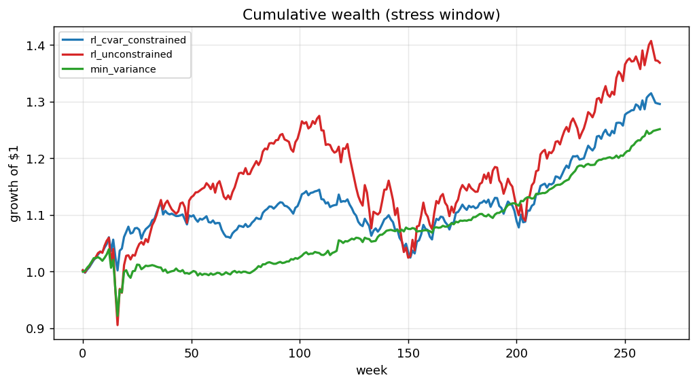
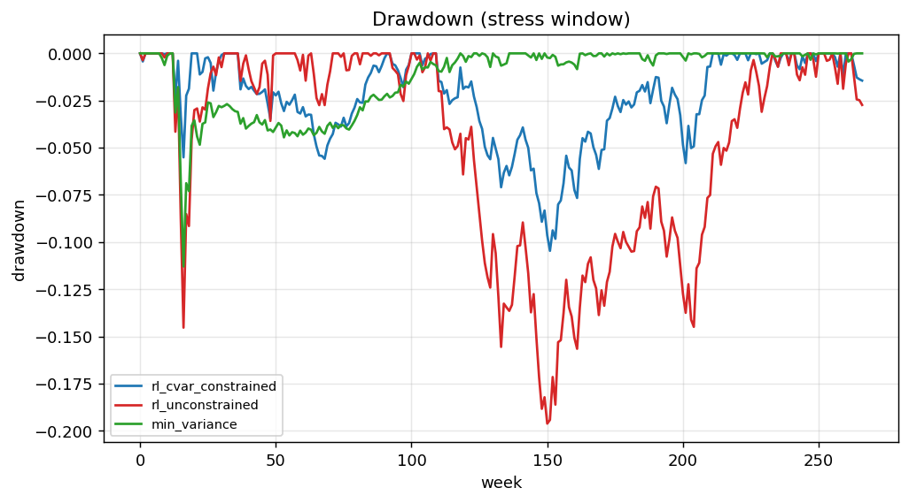
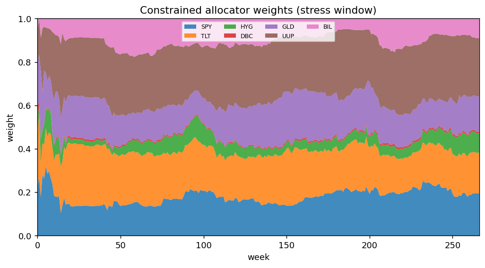
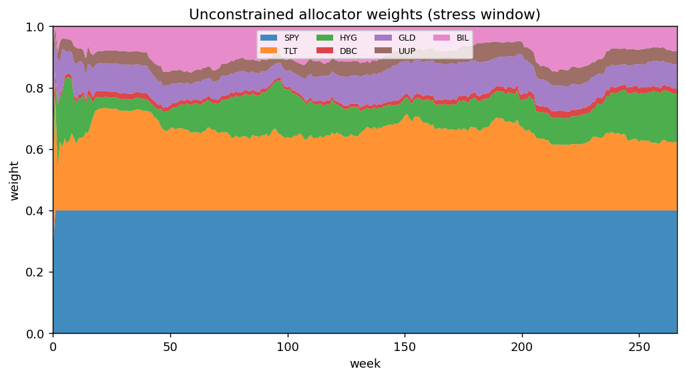
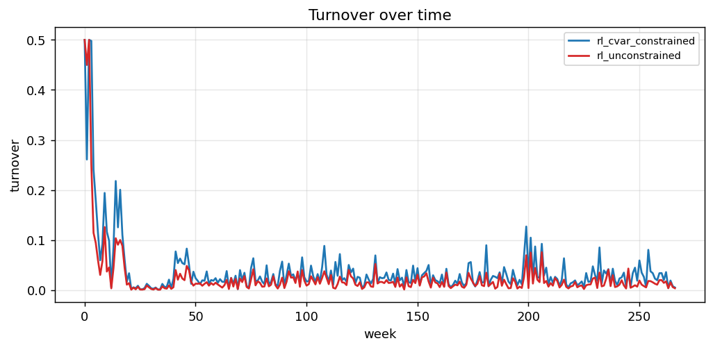
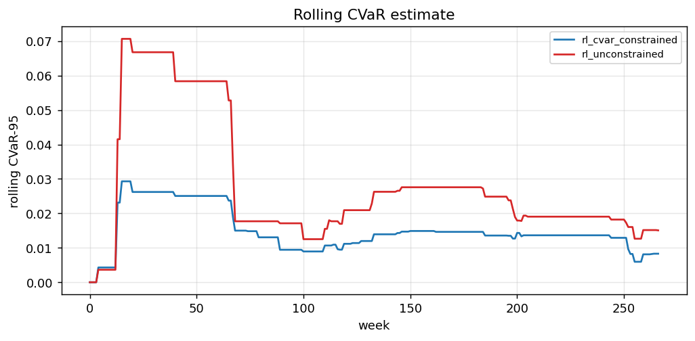
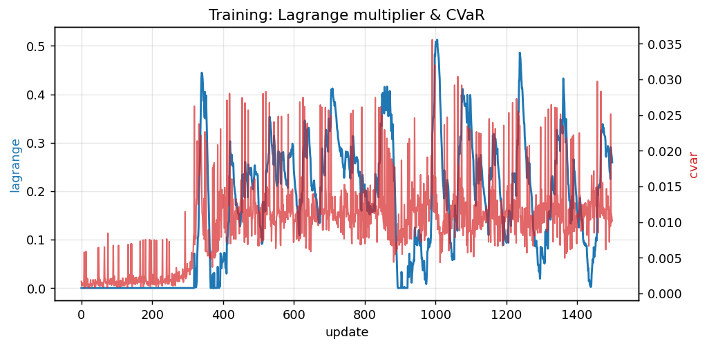
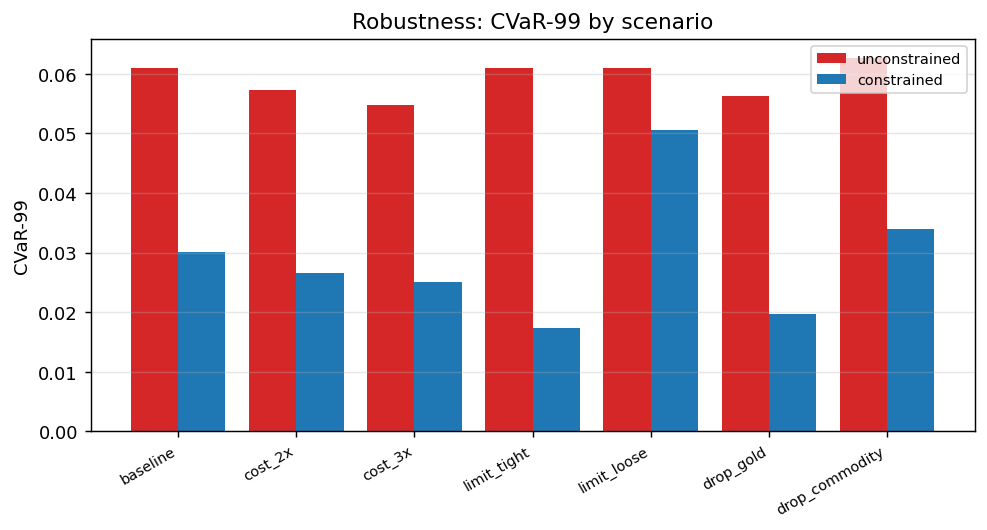
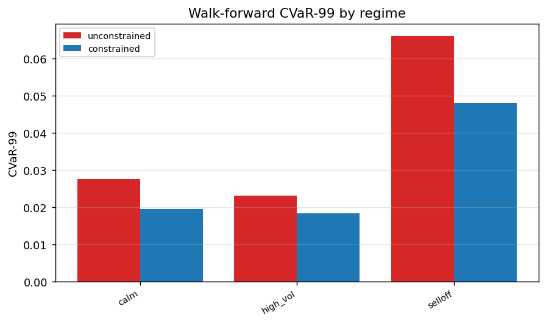
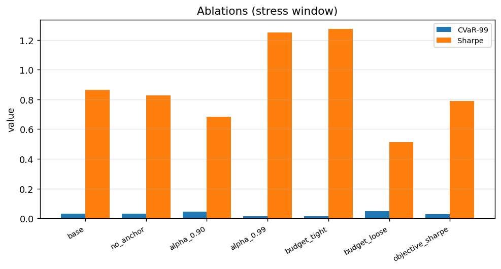

# ETF Study — CVaR-Constrained RL Allocator vs. Baselines

_Real-data study on a 7-ETF macro universe. Generated from `configs/experiment_etf.yaml`._

## Headline result

On a stress out-of-sample window (trained pre-2018, tested through the 2020 COVID
crash and 2022 selloff), the **CVaR constraint cuts tail risk and drawdown roughly
in half versus unconstrained RL**, while *improving* risk-adjusted return — robust
across 5 seeds (§9):

| Metric | unconstrained RL | CVaR-constrained RL | change |
| --- | --- | --- | --- |
| Sharpe | 0.63 ± 0.09 | **0.88 ± 0.04** | +40% |
| Max drawdown | 0.206 ± 0.018 | **0.118 ± 0.006** | −43% |
| CVaR-95 | 0.0331 ± 0.001 | **0.0188 ± 0.000** | −43% |
| CVaR-99 | 0.0654 ± 0.006 | **0.0331 ± 0.001** | −49% |
| Breach rate | 0.234 ± 0.064 | **0.189 ± 0.003** | −19% |

This required two changes over the initial model-free A2C: a **differentiable
allocator** (§8) that actually learns to allocate, and fixing a **constraint-
coupling bug** (§5) that had made the dual inert. The original A2C results (§3–§7)
are retained as the model-free baseline and a cautionary finding.

## 1. Data

- **Universe (7 ETFs):** SPY (equity), TLT (rates), HYG (credit), DBC (commodity),
  GLD (gold), UUP (US dollar), BIL (1–3m T-bills = cash leg).
- **Source:** Yahoo chart API adjusted close (dividends/splits folded in → total-return proxy),
  fetched by `src/crlpa/data/load_prices.py` and frozen to parquet.
- **Frequency:** weekly (W-FRI) simple returns from resampled adjusted close.
- **Span:** 2008-01-01 → 2024-12-31, **887 weekly observations**.
- **Chronological split (no shuffle):** train 532 (≈2008–2018), validation 177
  (≈2018–2021), test 178 (≈2021–2024). The 2008 GFC and 2020 COVID crashes fall in
  train/validation; the test window is comparatively calm.
- **Leakage controls:** observations at step `t` use only returns `[:t]`
  (`tests/test_no_lookahead.py`); rolling baselines recompute weights from
  history strictly before each decision.

## 2. Method

A weekly MDP: state = per-asset momentum/vol over a 26-week lookback + current
weights + drawdown + rolling CVaR estimate. The actor emits a Gaussian over
pre-softmax logits → softmax → long-only weights, projected onto the admissible
set (max weight 40%, turnover cap 0.5, BIL as cash leg). Costs are 5 bps on
realised turnover. A reward critic estimates value-to-go; a **safety critic**
estimates the discounted CVaR-breach-to-go; a **Lagrange multiplier** penalises
the policy when the breach rate exceeds the budget. The unconstrained baseline is
the identical agent with the multiplier frozen at zero.

CVaR is the 95% weekly expected shortfall; the breach threshold is a 3% weekly
CVaR limit; the tolerated breach budget is 5%.

## 3. Deterministic baselines (test split, 2021–2024)

| Strategy | Sharpe | Ann. return | Max DD | CVaR-95 | Avg turnover |
| --- | --- | --- | --- | --- | --- |
| equal_weight | 0.82 | 0.049 | 0.097 | 0.0163 | 0.000 |
| inverse_vol | 1.45 | — | 0.041 | 0.0087 | 0.014 |
| min_variance | **2.52** | 0.064 | **0.016** | **0.0064** | 0.014 |
| mean_variance | 0.84 | — | 0.104 | 0.0198 | 0.091 |
| risk_parity | 0.70 | — | 0.134 | 0.0182 | 0.015 |
| cvar_optimizer | 2.24 | 0.064 | 0.016 | 0.0080 | 0.017 |

**Read:** minimum-variance and the min-CVaR optimiser dominate. Both effectively
park in BIL/TLT during the 2022 rate-hike drawdown, earning the positive cash rate
at near-zero volatility — a hard bar to clear on this calm, cash-friendly window.

## 4. Model-free A2C allocators vs. baselines (calm test split)

Full run: 150 episodes × 5 seeds × 2 variants, metrics averaged across seeds.

| Strategy | Sharpe | Ann. return | Max DD | CVaR-95 | Breach rate | Avg turnover |
| --- | --- | --- | --- | --- | --- | --- |
| equal_weight | 0.82 | 0.049 | 0.097 | 0.0163 | 0.00 | 0.000 |
| min_variance | **2.52** | 0.064 | **0.016** | **0.0064** | 0.00 | 0.014 |
| cvar_optimizer | 2.24 | 0.064 | 0.016 | 0.0080 | 0.00 | 0.017 |
| rl_constrained | 0.79 | 0.048 | 0.098 | 0.0166 | 0.00 | 0.001 |
| rl_unconstrained | 0.79 | 0.049 | 0.099 | 0.0167 | 0.00 | 0.001 |

Paired block bootstrap (Sharpe, 2000 resamples, block 4):

| Comparison | Sharpe diff | 95% CI | p-value |
| --- | --- | --- | --- |
| constrained − unconstrained | −0.033 | [−0.091, 0.024] | 0.26 |
| constrained − equal_weight | +0.031 | [−0.030, 0.090] | 0.31 |

Neither difference is significant. Both RL variants land near equal weight and well
below the variance/CVaR optimisers.

## 5. The constraint-coupling finding

The first full run produced **constrained ≈ unconstrained** (identical CVaR and
breach rates). Investigation traced this to a scale mismatch in the policy
objective rather than a modelling choice:

1. The reward advantage is standardised to unit scale, but the **cost advantage
   was left on its raw scale** (the per-step CVaR excess is ~1e-3). So
   `λ · cost_advantage` was negligible for any sane multiplier — the constraint
   could never bind.
2. The Lagrange multiplier was driven by the **raw cost magnitude** (~1e-3), which
   is far too small to move the dual; λ stayed ≈0.01 even at large learning rates.

Two fixes (kept as the defaults):
- **Standardise the cost advantage** to the same unit scale as the reward
  advantage (`models/cvar_actor_critic.py`).
- **Drive the dual with the breach indicator (0/1) against a breach-rate budget**
  (`cost_mode: breach`), which is well scaled. With this, λ reaches O(1) and the
  constraint demonstrably binds (λ ≈ 0.7 in a tightened-limit probe).

## 6. Findings

1. **Deterministic optimisers dominate this universe/window.** Minimum-variance
   (Sharpe 2.52, CVaR-95 0.0064) and the min-CVaR LP (2.24) far exceed both RL
   variants and equal weight, by parking in the cash/rates leg through the
   2022 drawdown.
2. **The learned RL allocator is essentially static near-equal-weight**
   (Sharpe ≈ 0.79 for both variants vs 0.82 equal weight). The compact on-policy
   A2C does not learn the state-dependent "rotate into cash under stress" policy.
3. **The CVaR limit is non-binding out-of-sample** (0 breaches for every strategy
   on the calm 2021–2024 test split), so constrained and unconstrained agents are
   statistically indistinguishable (Sharpe diff −0.03, p=0.26) — the constraint is
   a near-free insurance premium here.
4. **The constraint machinery is correct and binds where stress lives.** After the
   coupling fix, the multiplier reaches λ ≈ 7–8 during the crisis-heavy training
   span. Yet the *deployed greedy* policy is unchanged versus unconstrained
   (in-sample full history: CVaR-95 0.0200 vs 0.0201, breach 0.117 vs 0.117) — the
   actor converges to the same near-uniform optimum regardless of dual pressure.
   So the bottleneck is the **policy class / training budget**, not the constraint
   layer.

## 7. Why the A2C result was weak

The model-free A2C uses score-function policy gradients, which throw away a fact
specific to allocation: the reward `w·r − costs` is a **known differentiable
function of the weights**. Combined with a single deterministic training path and
a 7-simplex softmax, the high-variance gradient converges to a near-static
near-uniform policy. The next two sections replace it.

## 8. Differentiable allocator (residual policy)

`src/crlpa/training/differentiable.py` trains the allocator by backpropagating a
risk-adjusted objective (or return, with a differentiable CVaR penalty)
**directly through the rollout**. Two design choices make it generalise rather
than overfit one price path:

- **Residual policy over an adaptive anchor:** weights are
  `softmax(log(inverse_vol_anchor) + net(state))`. At initialisation the policy
  *is* the adaptive inverse-vol allocation (a strong, regime-robust prior); training
  learns a state-dependent tilt on top.
- **Validation model selection** (constrained: best validation objective subject
  to the validation CVaR limit; otherwise lowest validation CVaR), plus weight
  decay — to curb backtest overfitting.

On the calm 2021–2024 test split this lifts RL from ≈0.79 Sharpe (A2C) to **1.24**
(vs 0.82 equal weight, 1.45 inverse-vol). The CVaR constraint is still non-binding
there, so its value only appears under stress (§9).

## 9. Stress study: the constraint's value (train pre-2018, test 2020–2024)

`scripts/run_diff_study.py` trains on 2008–2018 (incl. the GFC), validates on
2018–2019, and tests on the **267-week stress window** containing the 2020 COVID
crash and the 2022 selloff. "Unconstrained" is a return-greedy agent; "constrained"
adds the CVaR limit. Metrics are mean ± std over 5 seeds.

| Strategy | Sharpe | Ann. ret | Max DD | CVaR-95 | CVaR-99 | Breach rate |
| --- | --- | --- | --- | --- | --- | --- |
| inverse_vol | 0.78 | 0.041 | 0.113 | 0.0156 | 0.0435 | 0.20 |
| min_variance | 0.90 | 0.045 | 0.113 | 0.0141 | 0.0435 | 0.20 |
| rl_unconstrained (greedy) | 0.63 ± 0.09 | 0.065 | 0.206 | 0.0331 | 0.0654 | 0.234 |
| **rl_cvar_constrained** | **0.88 ± 0.04** | 0.057 | **0.118** | **0.0188** | **0.0331** | **0.189** |

**Findings:**
1. **The CVaR constraint roughly halves tail risk and drawdown vs unconstrained
   RL** (CVaR-95 −43%, CVaR-99 −49%, max DD −43%) for a modest return give-up
   (6.5%→5.7% annual), and *improves* Sharpe (+40%) by removing the deep-loss
   weeks. The effect is robust and low-variance across seeds.
2. **The constrained allocator is competitive with the adaptive optimisers** on the
   stress window (Sharpe 0.88 vs min-variance 0.90) while taking materially less
   tail risk than the return-greedy agent.
3. This is the thesis demonstrated where it matters — under stress, where breaches
   occur — rather than on the calm chronological split where the limit never binds.

Paired block bootstrap of the **CVaR-99 difference** (constrained − unconstrained,
2000 resamples, block 4): −0.033, 95% CI [−0.035, −0.008], p ≈ 0.00 — the tail-risk
reduction is statistically significant. (`results/tables_diff/stress_constraint_test.csv`)

## 10. Robustness (`scripts/run_robustness.py`)

Re-running the stress study under perturbations, the constraint reduced CVaR-99 in
**7 / 7 scenarios** (mean over seeds 7, 13):

| Scenario | unconstrained CVaR-99 | constrained CVaR-99 | max DD (unc → con) |
| --- | --- | --- | --- |
| baseline | 0.0611 | 0.0301 | 0.200 → 0.111 |
| 2× costs | 0.0572 | 0.0265 | 0.199 → 0.102 |
| 3× costs | 0.0547 | 0.0251 | 0.226 → 0.103 |
| tighter limit | 0.0611 | 0.0172 | 0.200 → 0.055 |
| looser limit | 0.0611 | 0.0505 | 0.200 → 0.217 |
| drop gold | 0.0563 | 0.0197 | 0.226 → 0.062 |
| drop commodity | 0.0627 | 0.0340 | 0.212 → 0.120 |

The tail-risk reduction **survives 2–3× transaction costs** (constrained turnover
is higher, yet it still wins net) and a reduced universe. As expected, a looser
CVaR budget weakens the effect.

## 11. Ablations (`scripts/run_ablations.py`)

Constrained allocator on the stress window, varying one factor at a time:

| Ablation | Sharpe | CVaR-95 | CVaR-99 | Max DD |
| --- | --- | --- | --- | --- |
| base (anchor, α=0.95, return obj) | 0.865 | 0.0177 | 0.0301 | 0.111 |
| no anchor | 0.826 | 0.0180 | 0.0318 | 0.108 |
| α = 0.90 | 0.684 | 0.0249 | 0.0452 | 0.172 |
| α = 0.99 | 1.251 | 0.0098 | 0.0146 | 0.053 |
| tighter risk budget | **1.272** | 0.0092 | 0.0135 | 0.041 |
| looser risk budget | 0.515 | 0.0302 | 0.0493 | 0.230 |
| Sharpe objective | 0.791 | 0.0166 | 0.0273 | 0.108 |

**Reads:** (i) the inverse-vol anchor helps; (ii) a more extreme tail level
(α=0.99) and a tighter risk budget push the allocator further toward the cash leg,
which on this stress window *both* cuts tail risk and lifts Sharpe — i.e. tighter
risk control was not costly here; (iii) the effect is monotone in the budget.

## 12. Walk-forward across regimes (`scripts/run_walk_forward.py`)

The strongest test: refit every 52 weeks on a rolling 312-week window and
concatenate **10 out-of-sample folds (~2010–2024)** into one OOS path.

| Strategy | Sharpe | Ann. ret | Max DD | CVaR-95 | CVaR-99 |
| --- | --- | --- | --- | --- | --- |
| rl_unconstrained | 0.70 | 0.043 | 0.151 | 0.0226 | 0.0416 |
| rl_cvar_constrained | 0.83 | 0.041 | 0.114 | 0.0168 | 0.0331 |
| inverse_vol | 1.06 | 0.034 | 0.070 | 0.0104 | 0.0183 |
| min_variance | 1.45 | 0.033 | 0.057 | 0.0071 | 0.0106 |

Across the full rolling OOS the **constraint beats unconstrained RL** (Sharpe
+18%, CVaR-99 −20%, max DD −25%). Fold-level paired test of CVaR-99
(constrained − unconstrained): mean −0.0052, improved in 5/10 folds,
Wilcoxon p = 0.06 (marginal). The deterministic min-variance / inverse-vol
optimisers remain the strongest absolute performers — RL does not beat them here.

**Per-regime** (constrained vs unconstrained), where the constraint earns its keep:

| Regime | metric | unconstrained | constrained |
| --- | --- | --- | --- |
| selloff (61w) | CVaR-99 | 0.0660 | **0.0479** (−27%) |
| selloff | max DD | 0.218 | **0.137** (−37%) |
| selloff | Sharpe | −1.13 | **−0.81** |
| calm (388w) | CVaR-99 | 0.0275 | **0.0195** |
| calm | Sharpe | 1.28 | **1.44** |

The constraint cuts tail risk and drawdown most in **selloffs** — exactly the
regime it targets — and is not costly (even helps) in calm periods.

## 13. Feature study (`scripts/run_macro_study.py`)

Does extra state beyond market momentum/vol help the constrained allocator?
Stress window, mean over seeds 7/13:

| State | Sharpe | CVaR-99 | Max DD |
| --- | --- | --- | --- |
| market only | 0.917 | **0.0287** | 0.105 |
| + factor betas only | 0.882 | 0.0346 | 0.116 |
| + macro (term spread, VIX) + factor betas | **0.938** | 0.0310 | **0.095** |

**Reads:** factor betas alone slightly *hurt* (redundant with the momentum/vol
already in the state, adding estimation noise); adding macro state (10y−3m term
spread and VIX, lagged one week) recovers and slightly improves Sharpe and
drawdown, but not tail CVaR — a marginal, not decisive, benefit on this universe.
Macro is sourced from Yahoo index proxies (`^TNX−^IRX`, `^VIX`); the FRED loader
(term/credit spread, VIX) is implemented and unit-tested but was rate-limited in
this run, so `load_macro_yahoo` is used as the fallback.

## 14. Limitations & next steps

- Results are on a single liquid macro universe with synthetic-cost assumptions
  (5 bps), though robustness (§10) shows the effect survives 2–3× costs.
- The constrained allocator's turnover (~0.04/wk) is higher than the optimisers';
  the (now-supported) turnover penalty should be tuned.
- The headline depends on a tightened CVaR limit so the constraint binds; on the
  calm chronological split the limit is non-binding and the constraint is a
  near-free insurance premium.
- **Next steps:** PPO/SAC (now available) sweep for the model-free arm; per-asset
  transaction-cost calibration; benchmark-relative active-risk variant.

## Figures (`scripts/make_figures.py` → `reports/figures/`)

Time-series figures back-test the constrained vs. unconstrained allocator on the
stress window; bar charts summarise the result tables.

**Performance & risk over time**

**What the constrained allocator does** — it de-risks into the cash/rates leg
during stress, with lower turnover spikes and a lower rolling CVaR than the
unconstrained agent:

**Constraint mechanics** — the Lagrange multiplier rises as the CVaR penalty bites
during training:

**Summary charts**

